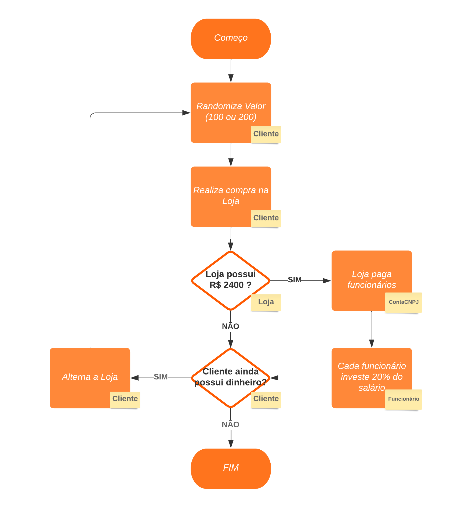
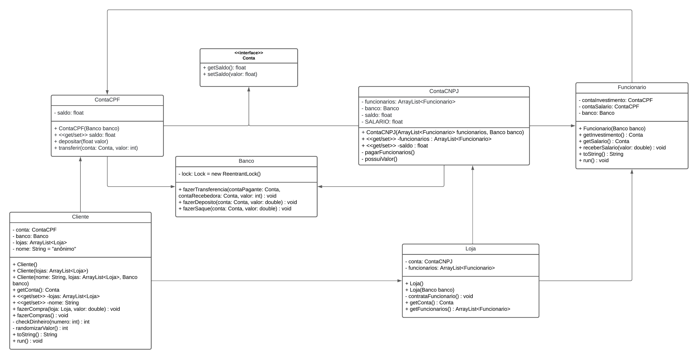

# Sistema Bancário (ATV-2)

Projeto em java que simula um sistema bancário, no qual ocorre interações entre o cliente, funcionário e loja.

## Fluxograma de execução do código

Vale frizar que:
- Existem no total 5 clientes, cada um com 1000 reais;
- Há no total 4 funcionários, sendo 2 em cada loja;
- São 2 lojas;
- 2 tipos de conta, sendo elas: ContaCPF e ContaCNPJ;
- E apenas um banco.

## UML

## Stack utilizada

**Java 17** e **JUnit5**

Foi utilizada a metodologia TDD para o desenvolvimento do projeto.

